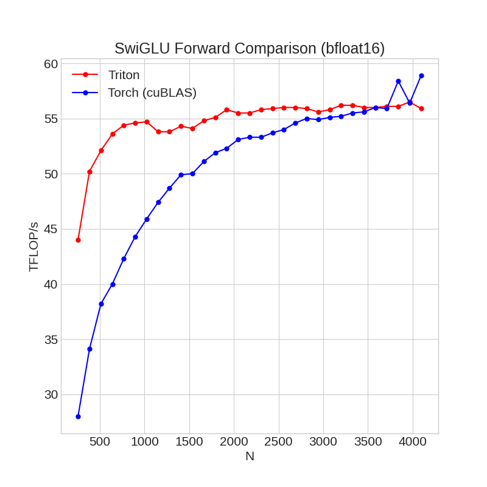
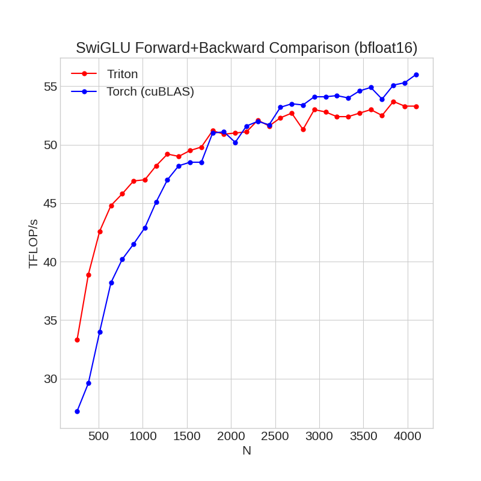
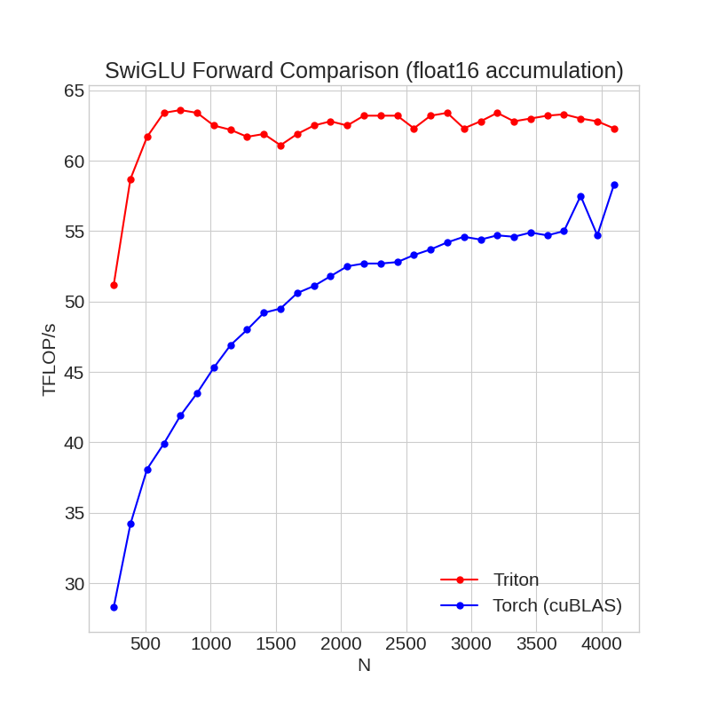
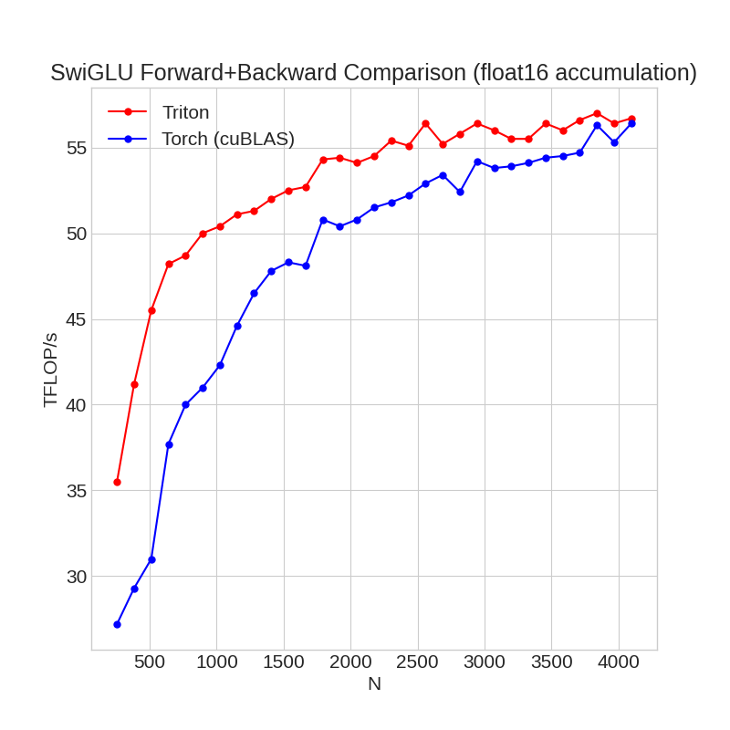

# Triton Fused SwiGLU

A Triton kernel implementing fused [SwiGLU](https://arxiv.org/pdf/2002.05202.pdf) forward and backward pass. Supports bfloat16 and float16 with optional fp16 tensorcore accumulation. 

## Installation

```
git clone https://github.com/fattorib/fused_swiglu.git
cd fused_swiglu
pip install .
```

**Note**: As of January 2024, Triton 2.2.0 offers better performance than the pre-installed Triton 2.1.0 that comes with PyTorch 2.1.x. After installing ```fused_swiglu``` you can manually upgrade Triton after with:
```bash 
pip install -U triton==2.2.0
```
Pip might complain that PyTorch doesn't support Triton 2.2.0, but it does. 


## Use
Two SwiGLU kernels are supported, the first, ```fused_swiglu.FusedSwiGLU``` runs the matmuls in bfloat16 precision with float32 accumulation. The second kernel, ```fused_swiglu.FastAccumFusedSwiGLU``` runs the matmuls in float16 precision with optional float16/float32 accumulation for extra performance on consumer GPUs, at the loss of some precision (see [this thread](https://twitter.com/main_horse/status/1742013125090795531) for an explanation).

**Kernel 1 (bfloat16):**
```python
from fused_swiglu import FusedSwiGLU
w_gate = torch.randn((d_model, d_intermediate), dtype = torch.bfloat16, device = 'cuda:0')
w_up = torch.randn((d_model, d_intermediate), dtype = torch.bfloat16, device = 'cuda:0')
x = torch.randn((bs, sq, d_model),  dtype = torch.bfloat16, requires_grad=True)
out = FusedSwiGLU.apply(x, w_gate, w_up)
```

**Kernel 2 (float16):**
```python
from fused_swiglu import FastAccumFusedSwiGLU
w_gate = torch.randn((d_model, d_intermediate), dtype = torch.float16, device = 'cuda:0')
w_up = torch.randn((d_model, d_intermediate), dtype = torch.float16, device = 'cuda:0')
x = torch.randn((bs, sq, d_model),  dtype = torch.float16, requires_grad=True)
out = FastAccumFusedSwiGLU.apply(x, w_gate, w_up)
```

## Benchmarks

Benchmarks are performed using Triton's benchmark utilities. 
<details>
<summary>Details</summary>
<br>
RTX 4070, Batch size = 4, Sequence length = 2048, `d_intermediate = 3 * d_model`
</details>

### bfloat16

**Forward:**


**Forward+Backward:**


### float16

**Forward:**

**Forward+Backward:**

## Tests
```bash
pytest fused_swiglu/test_swiglu.py
```

## References

```
@article{DBLP:journals/corr/abs-2002-05202,
  author       = {Noam Shazeer},
  title        = {{GLU} Variants Improve Transformer},
  journal      = {CoRR},
  volume       = {abs/2002.05202},
  year         = {2020},
  url          = {https://arxiv.org/abs/2002.05202},
  eprinttype    = {arXiv},
  eprint       = {2002.05202},
  timestamp    = {Fri, 14 Feb 2020 12:07:41 +0100},
  biburl       = {https://dblp.org/rec/journals/corr/abs-2002-05202.bib},
  bibsource    = {dblp computer science bibliography, https://dblp.org}
}
```